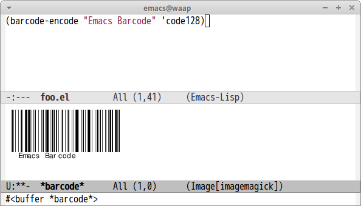

# barcode.el

[libbarcode](http://www.gnu.org/software/barcode/) binding of Emacs Lisp.

## Screenshot

## Requirements

- Emacs 25 built with `--with-modules`

## Usage

#### `(barcode-encode string encoding-type)`

Encode string to barcode by `encoding-type`.

You can choose each of following encodings. Default encoding is `'code128`
- any
- ean
- upc
- isbn
- code39
- code128
- code128c
- code128b
- i25
- coderaw128
- cbr
- msi
- pls
- code93

You can use this function as command and if you select region then it uses
region area as `string`.
